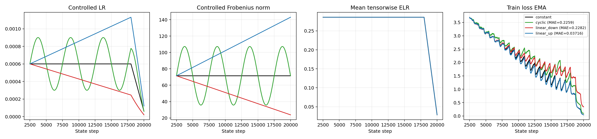
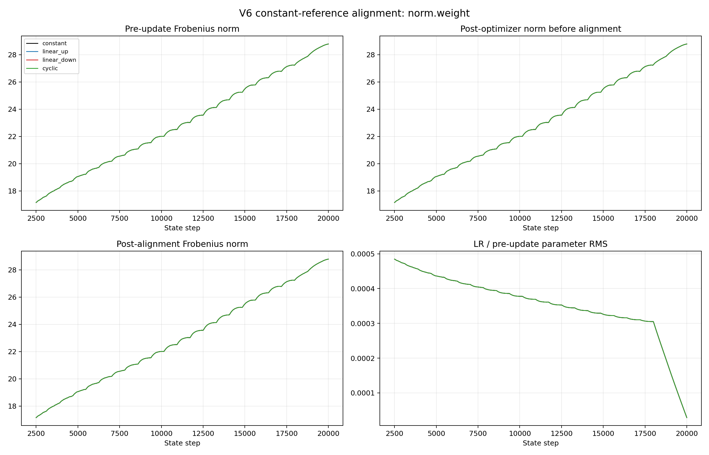

# callapse_v6

V6 is a one-variable causal ablation of
[`callapse_v5`](https://github.com/zhangshaobo051215/callapse_v5). It asks
whether the schedule-dependent magnitude drift of the final RMSNorm gain
(`norm.weight`) is sufficient to explain V5's failed loss collapse.

## Result

V6 **does not collapse** under the preregistered `0.03` EMA-MAE threshold.

| branch | EMA-MAE vs constant | decision |
|---|---:|---|
| `linear_up` | 0.0371595 | FAIL |
| `linear_down` | 0.2282249 | FAIL |
| `cyclic` | 0.2258968 | FAIL |



The intervention itself worked exactly: all 70,000 alignment rows passed, and
the maximum relative norm-alignment error was `2.17e-7`. V6 therefore rejects
the narrow hypothesis that matching only the final RMSNorm gain's scalar norm
trajectory is sufficient to restore collapse. It does not show that the final
gain is irrelevant; its direction, optimizer state, and the other RMSNorm
gains were not aligned.

## Intervention

Everything inherited from V5 is unchanged: model, shared step-2500 prefix,
data order, optimizer, four schedules, and the q(t)-controlled scope.

- q(t)-controlled: 100 named tensors, or 148 independent control units after
  splitting fused Q/K/V weight and bias (`5,378,880` scalars).
- q(t)-uncontrolled: 27 named tensors, including all 25 RMSNorm gains and the
  classifier head.
- The final `norm.weight` stays in the uncontrolled optimizer group and uses
  the base LR.
- `constant` records its post-AdamW `||norm.weight||_F` at every state step.
- After its own AdamW update, each non-constant branch is radially rescaled so
  that only this scalar norm equals the same-step `constant` target.
- Parameter direction and AdamW moments are not copied or modified.



## Experiment

- Dataset: Tiny-ImageNet-200, 100,000 training images, 10,000 validation
  images, 200 classes, 64x64 resolution.
- Model: ViT-Tiny, patch size 8, embedding width 192, 12 blocks, 3 attention
  heads, MLP ratio 4, bias-free RMSNorm; 5,422,280 parameters.
- Training: batch size 128, 20,000 state steps, shared prefix through step
  2,500, about 25.6 epochs and TPP about 30.7.

## Reproduce

Place the registered V5 prefix at the sibling path expected by `go_v6.sh`,
then run:

```bash
bash go_v6.sh
```

The launcher runs tests and preflight checks, executes `constant` first,
trains the other three branches, generates all monitoring plots, and applies
the fixed gate after the engineering audits. A scientifically negative
collapse result intentionally makes the final gate exit nonzero; inspect
`analysis/iteration_gate.json` to distinguish it from an engineering failure.

## Artifacts

- Full local output: `outputs/expanded_block_affine_rmsnorm_finalnorm_v6_tensor_monitoring/`
- Lightweight GitHub result: `results/expanded_block_affine_rmsnorm_finalnorm_v6_tensor_monitoring/`
- Full archive metadata: `results/.../FULL_ARCHIVE.txt`
- Detailed numerical report: [`RESULTS.md`](RESULTS.md)

The full 1.94 GB archive is intentionally not committed to GitHub.
